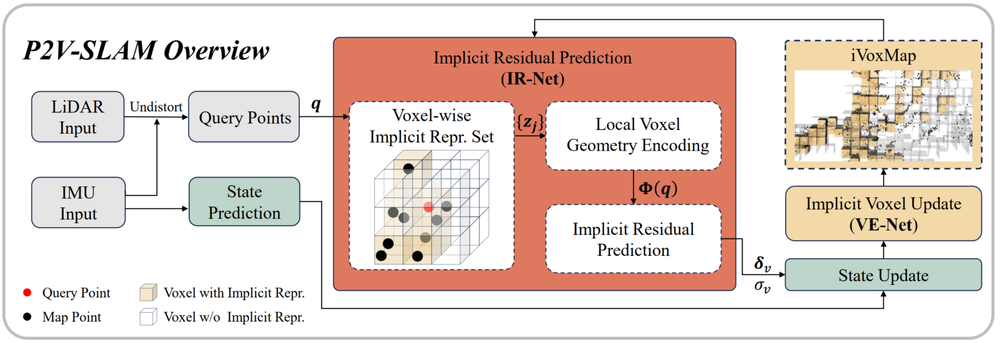

# P2V-SLAM: An Implicit Point-to-Voxel LiDAR SLAM

This repository contains the open-source code for our *IEEE Transactions on Automation Science and Engineering (T-ASE)* paper: **"Implicit Point-to-Voxel LiDAR-IMU SLAM"**.  

The paper is currently available as early access: [https://ieeexplore.ieee.org/document/11480788](https://ieeexplore.ieee.org/document/11480788)

<div align="center">
  
  <p align="center"><b>Overview of the proposed point-to-voxel SLAM algorithm.</b></p>
</div>

Unlike traditional "point-to-plane" observation models, we propose an **implicit point-to-voxel** observation model to achieve reliable and robust localization in unstructured environments.

<table table-layout="fixed" width="100%">
  <tr>
    <td align="center" width="50%">
      
    </td>
    <td align="center" width="50%">
      
    </td>
  </tr>
  <tr>
    <td align="center" colspan="2">
      Point-to-voxel matches ($\color{green}{\textbf{green}}$) and point-to-plane matches ($\color{red}{\textbf{red}}$). Our P2V matches are more consistent in tree leaf regions.
    </td>
  </tr>
</table>


## 1. Installation

### Dependencies

The code has been tested on Ubuntu 22.04 with ROS1.

This code is developed based on [PV-LIO](https://github.com/HViktorTsoi/PV-LIO).

Dependencies include:
- PCL >= 1.8
- Eigen >= 3.3.4
- `livox_ros_driver`  
  (If you do not need to run a real Livox LiDAR, you only need to ensure that `livox_msg_ros` messages can be compiled. We provide a pure message version: [this repo](https://github.com/LarryDong/livox_msg_ros2))

This code runs Torch in C++, so it also needs `libtorch` and `onnxruntime`.

- **libtorch**: See [https://docs.pytorch.org/cppdocs/installing.html](https://docs.pytorch.org/cppdocs/installing.html). (You only need to extract libtorch and set the correct path in `CMakeLists.txt`; full installation is not required.)

- **onnxruntime**: [https://github.com/microsoft/onnxruntime](https://github.com/microsoft/onnxruntime) (Tests show that ONNX runtime provides several times faster inference compared to using raw models.)


## 2. Usage

### How to run?

Run the launch file. For example, for the Botanic Garden Dataset, run:

```bash
# In one terminal:
roslaunch p2v-slam run_BotanicGarden.launch
# In a new terminal:
rosbag play 1018_13.bag
```

You can download a demo Botanic Garden sequence (`1018_13`) from [GoogleDrive](https://drive.google.com/drive/folders/1FE4UcP2JDc58FXPOK6Fh0OoNnaSpKdTu?usp=sharing) or the full dataset from the [BotanicGarden Repo](https://github.com/robot-pesg/BotanicGarden).


### What should you configure?

The `config/avia_BG.yaml` configuration file is loaded at launch. Parameters in this file are documented in detail.

**Required parameters:** model path, number of CPU cores.

Depending on the dataset and LiDAR type, you may need to adjust parameters such as the number of observation columns and iteration count to achieve optimal performance.

Additionally, if using a different LiDAR or dataset, you need to set the topic name, LiDAR-IMU extrinsic parameters, etc.

Currently, we only provide a configuration file for the Botanic Garden dataset with the Avia LiDAR. However, we have also tested and validated the code on mid360 and Ouster data.


## 3. How to train your own model?

`p2v-slam` requires two neural networks:

1. **VE-Net**: Extracts implicit features from voxels.
2. **IR-Net**: Predicts observation residuals and uncertainty.

The pre-trained models are available at: `./model/ir-net.onnx` and `./model/ve-net.onnx`

If you wish to retrain your own models, we provide the complete model code, training code, and training data. See the files and instructions in the `Python` directory.

If you are only testing SLAM, you can directly use the provided models.


## 4. Acknowledgements

We build upon the excellent work of [PV-LIO](https://github.com/HViktorTsoi/PV-LIO). We thank the authors for their contribution to the community.

## 5. Known Issues

1. P2V-SLAM uses the first 2 seconds of data for initialization. During this period, aggressive motion may lead to inaccurate IMU trajectory estimation and consequently large errors in the initial map.
2. Non-repetitive scanning solid-state LiDARs produce dense environmental point clouds. Performance may degrade when using mechanical LiDARs or repetitive scanning modes.
3. Model accuracy is affected by the distribution of training data. When training, you should select PLY files whose point cloud distribution closely matches your target application scenario.
4. The quality of training data directly affects the final algorithm accuracy. High-precision point cloud maps are recommended. Alternatively, point clouds obtained from SLAM algorithms can be used.

